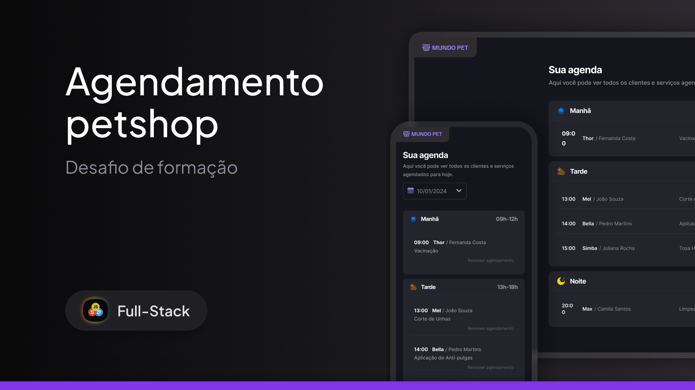

# Pet Shop

<p align="center">

</p>

## Sobre

<p>This is a simple pet shop appointment system.</p>

## Technologies

- `HTML`
- `CSS`
- `Javascript`
- `Babel`
- `webpack`

## Installation

```bash
# clone project
$ git clone https://github.com/CiceroEduardo84/PetShopAppointment.git

# install dependencies
$ npm install

# run simulation api
$ npm run server

# run interface
$ npm run dev
```

